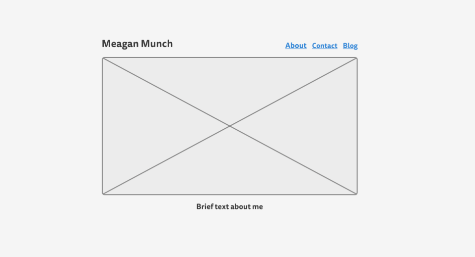
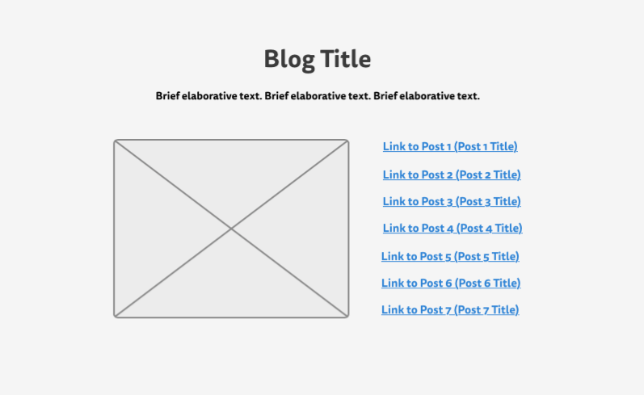

####What is a wireframe?

A wireframe is a bare-bones model of a site page that denotes where elements such as text, images, links and media will be placed without addressing the content or style of these elements.

####What are the benefits of wireframing?

Wireframing allows desingers to ensure that a site's layout is user frindly and easily navigable without getting bogged down in minutia. Because wireframes are simple they are easily changed, making the early stages of a site's design speedier. Wireframes also aid the construction of a site by making it clear where elements should be placed. 

####Did you enjoy wireframing your site?

I thought it was ok. Starting from scratch with the layout was slow but after some sketching I got the hang of what I was going for aesthetically. When I was done I was happy to have a template from which to eventually build my site.

####Did you revise your wireframe or stick with your first idea?

I stuck with my first idea.

####What questions did you ask during this challenge? What resources did you find to help you answer them?

My primary question was "How the f do I want this page to look?" I answered it by looking at a couple other personal sites and drawing from what I enjoyed looking at and navigating.

####Which parts of the challenge did you enjoy and which parts did you find tedious?

As always, the written reflection was the most tedious part of the challenge. 
