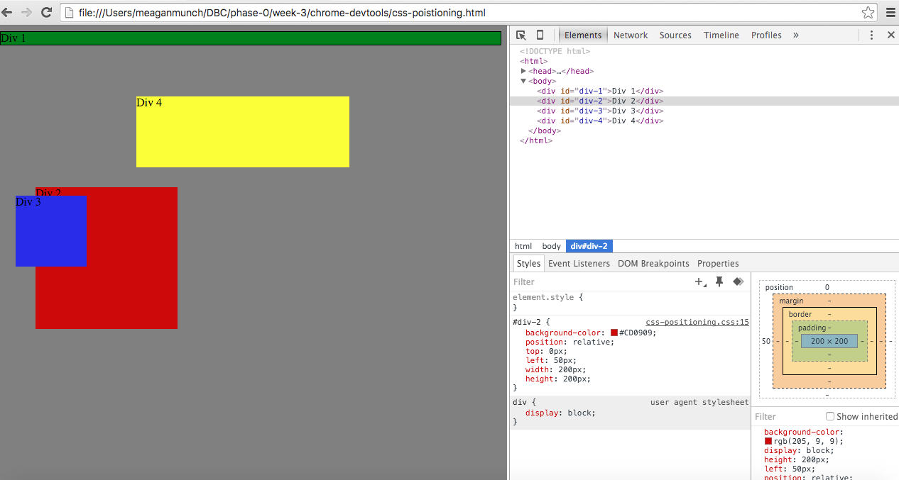
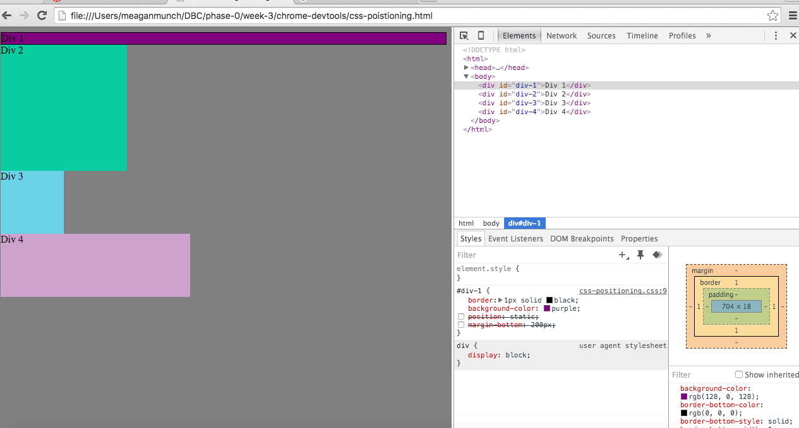
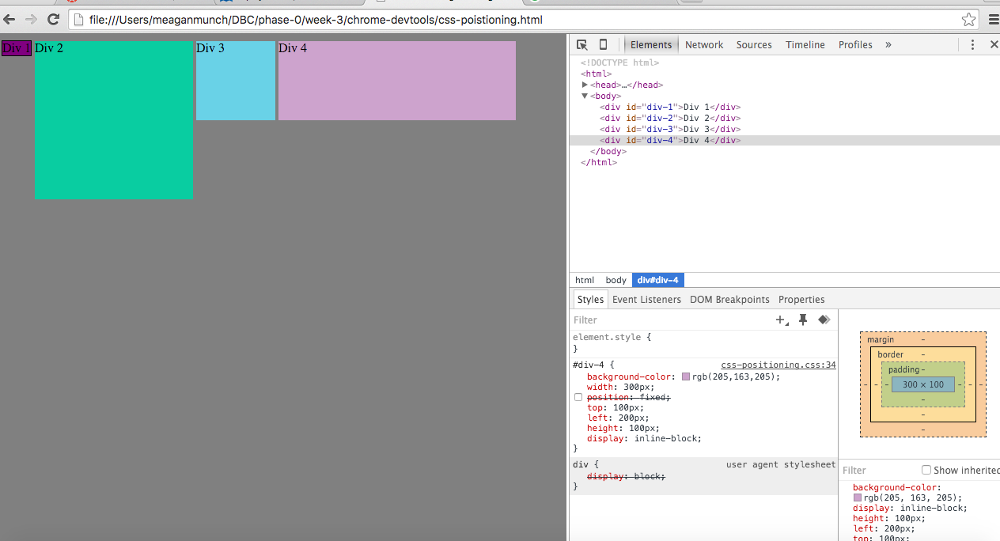
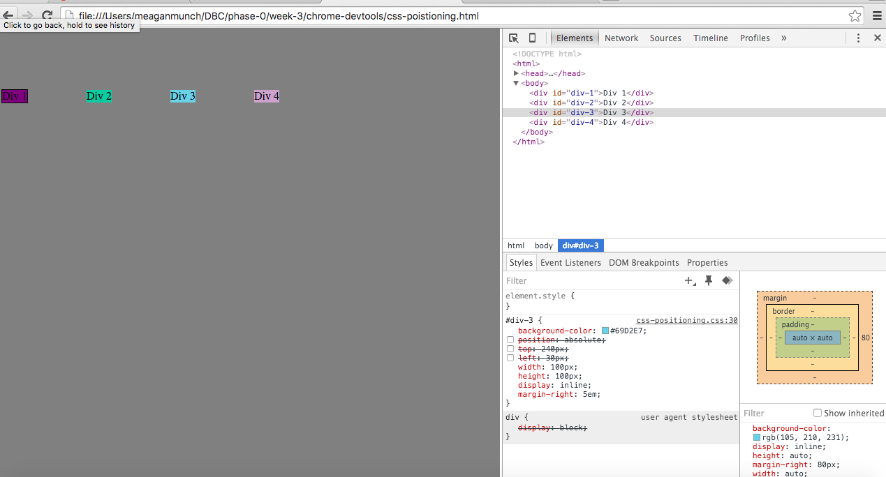
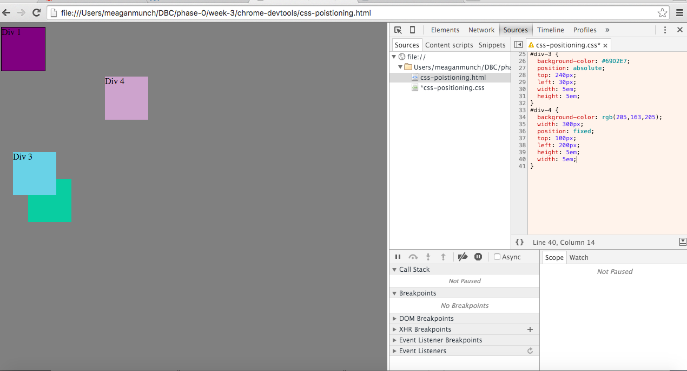
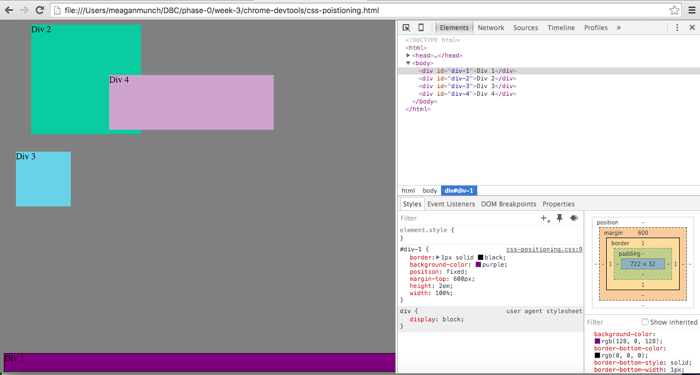
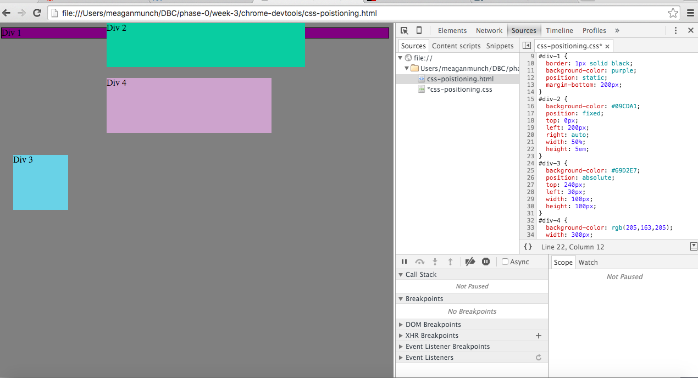
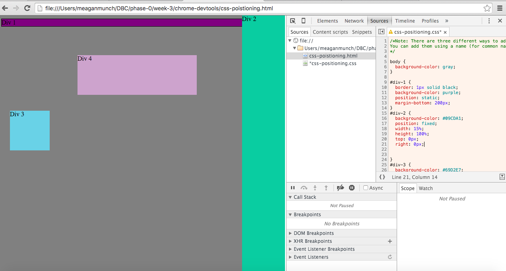
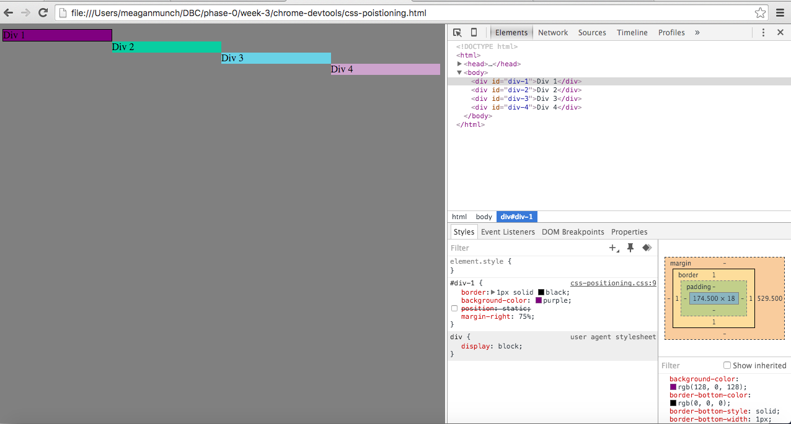

How can you use Chrome's DevTools inspector to help you format or position
elements?

The DevTools inspector allows you to format or position elements either by altering their source CSS stylesheet or selecting individual objects and altering CSS factors such as position, margin etc  

How can you resize elements on the DOM using CSS? 

You can resize elements on the DOM either by altering their source CSS stylesheet or selecting individual objects and altering CSS factors such as width, height etc

What are the differences between absolute, fixed, static, and relative positioning? Which
did you find easiest to use? Which was most difficult? 

Objects with absoloute positioning are placed in relation to their parent object in the HTML, objects with static positioning have no default position and are therefore static on the page, objects with fixed positioning stay in the same spot regaurdless of the location of the objects around them in the browser window, and objects with relative positioning can be moved by altering their position up down left or right relative to where they are originally positioned.

What are the differences between margin, border, and padding? 

Margins are composed of the invisible space that surround the border of an object, padding is space between the object and the border, and an object's border lies between an object's padding and margin.

What was your impression of this challenge overall? (love, hate, and why?)

I didn't love this challenge for the simple reason that my head does not seem to be taking to CSS too easily. I feel like I'm getting by on trial and error and not a thourough understanding of what I'm doing.
