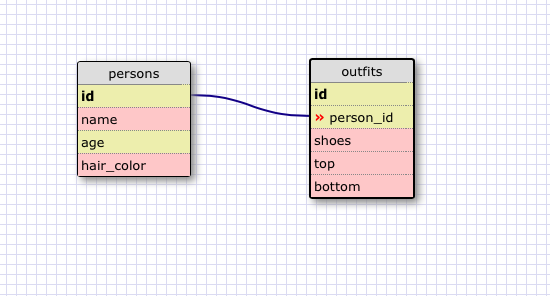

1. SELECT * FROM states;

2. SELECT * FROM regions;

3. SELECT state_name, population FROM states;

4. SELECT state_name, population FROM states
   ORDER BY population DESC;

5. SELECT state_name FROM states
   WHERE region_id = 7;

6. SELECT state_name, population_density FROM states
   WHERE population_density > 50
   ORDER BY population_density ASC;

7. SELECT state_name FROM states
   WHERE population BETWEEN 1000000 and 1500000;

8. SELECT state_name, region_id FROM states
   ORDER BY region_id ASC

9. SELECT region_name FROM regions
   WHERE region_name LIKE '%central%';

10. SELECT states.state_name, regions.region_name FROM states
    JOIN regions ON states.region_id = regions.id
    ORDER BY region_id;

####What are databases for?
Databases are for storing data in a structured way so that it can easily be searched and accessed.

####What is a one-to-many relationship?
A one-to-many relationship is a relationship between two sets of data in which the first set has only one of the second set but that second set has many of the first. You can identify a one-to-many relationship using the phrases "____ belongs to a ____. ____ has many ____."

####What is a primary key? What is a foreign key? How can you determine which is which?

A primary key is the main identifier for a row in a table. A foreign key is a column that contains the primary key of another table in the database. No values in the primary key column can be NULL and each primary key value is unique for a table, while foreign key values can be NULL and do not have to be unique.

How can you select information out of a SQL database? What are some general guidelines for that?

You can select data out of a SQL database by using the syntax "SELECT * FROM table" to reference all columns in a table and "SELECT column_a, column_b FROM table" to select individual or multiple columns. Rows can be selected for using the WHILE operator and information can be ordered using the ORDER BY operator. After all clause calls are made the statement that calls for data must end in a semicolin.

