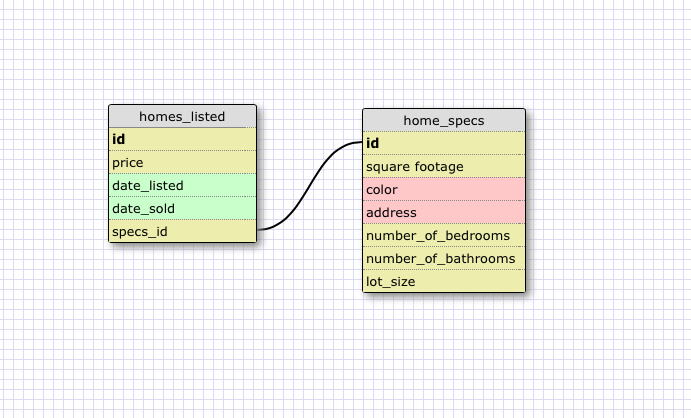
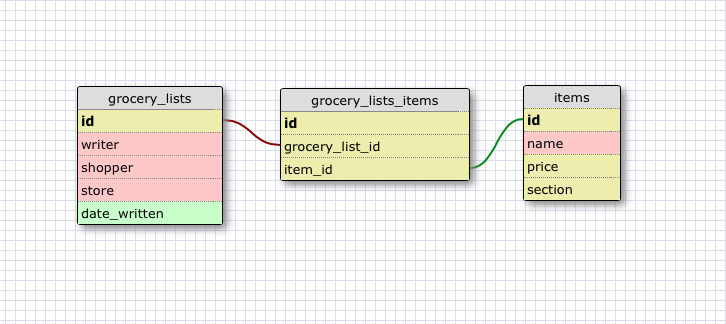

I created two tables, one tracking price, date listed and date sold data of a group of houses that could be used for a realtor's office. To limit the size of this table I created another table that listed the specific characteristics of each house. This relationship is one-to-one because each house only has one answer to each spec field and spec field values belong only to individual houses.

####What is a one-to-one database?

A one-to-one database is a set of two tables that has properties that exist as pairs: each item may only have one of the other, such as countries and capital cities, husbands and spouses, or buildings and addresses.

####What is a many-to-many database?

A many-to-many database is a set of three tables, one acting as a join table between the other two.

####When would you use a many-to-many database? (Think generally, not in terms of the example you created).

You would use a many-to-many database when items have many properties of another item AND VICE VERSA. For example, cars makes can have different colors and different colors can appear on different car makes. Classes have multiple instructors and instructors teach multiple classes.

####What is confusing about database schemas? What makes sense?

I'm honestly having a harder time wrapping my head around many-to-many schemas than I am one-to-one, but I think the information just needs a little bit more time to sink in and be used in practice.  

